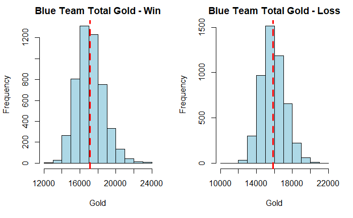

# Colton Behannon - Data Science Portfolio
Portfolio showing some of my data science work and projects

# [Project 1: League of Legends Victory Analysis](https://github.com/coltonbehannon/LOL-Victory-Analysis/blob/main/LeagueofLegends_Victory_Analysis.pdf)
* Built a k-nearest neighbor classifier to predict the victorious team in a League of Legends match based on the first 10 minutes of gameplay
Click title for full .pdf report or [here](https://github.com/coltonbehannon/LOL-Victory-Analysis/blob/main/LeagueOfLegends_VictoryPredictions.Rmd) for the R-Markdown file.

# [Project 2: Housing Price Analysis](https://github.com/coltonbehannon/Housing-Price-Analysis-SAS/blob/main/Housing%20Price%20Analysis.pdf)
* Built several models within SAS to come up with the best framework for estimating the real cost of a home so that no money is left on the table when selling your home.

