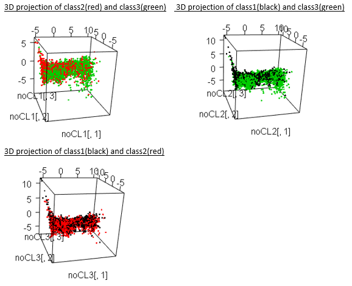
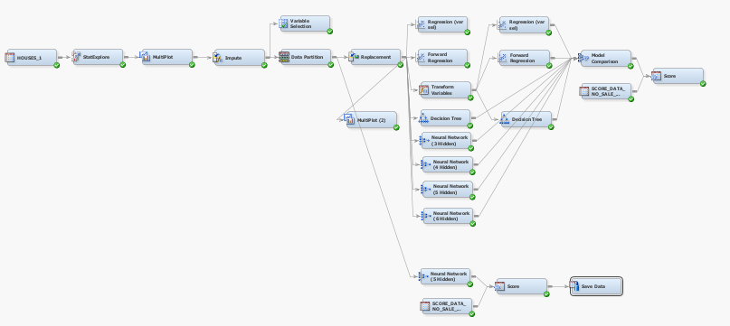
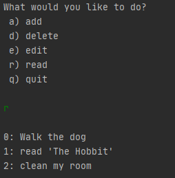
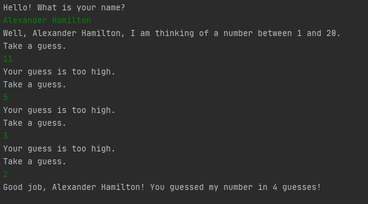
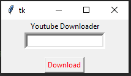
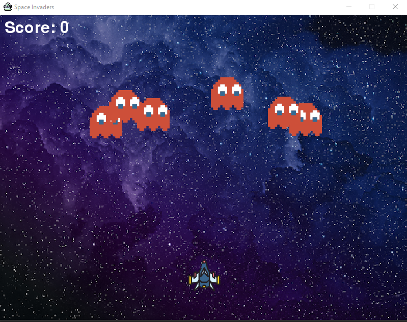

# Colton Behannon
Some examples of my data science work and previous projects.

# [League of Legends Victory Analysis](https://github.com/coltonbehannon/LOL-Victory-Analysis/blob/main/LeagueofLegends_Victory_Analysis.pdf)
* Built a k-nearest neighbor classifier to predict the victorious team in a League of Legends match based on the first 10 minutes of gameplay. This project was completed using R.
Click title for full .pdf report or [here](https://github.com/coltonbehannon/LOL-Victory-Analysis/blob/main/LeagueOfLegends_VictoryPredictions.Rmd) for the R-Markdown file.

# [MLB Salary Prediction - Pitchers](https://github.com/coltonbehannon/MLB-Salary-Prediction-Pitchers/blob/main/MLBSalaryPrediction-Pitchers.pdf)
* Uses the stats recorded for pitchers, from 2003 to 2016, to classify their salary bracket based on their performance using several machine learning techniques.

# [Housing Price Analysis](https://github.com/coltonbehannon/Housing-Price-Analysis-SAS/blob/main/Housing%20Price%20Analysis.pdf)
* Built several models within SAS to come up with the best framework for estimating the real cost of a home so that no money is left on the table when selling your home. This project was completed using SAS.

# Bonus!
* While making my way through undergrad I taught coding to hundreds of students and built up a decent set of projects for beginners to try out. I love to share these so that others could make use of them or simply want to check them out.

# [To-Do List](https://github.com/coltonbehannon/Coding-Projects-Teaching/blob/main/To-Do%20List/main.py)
* This project was great for getting students excited about coding by creating a relatively large project that they could actually use. This was usually the first big project after going over the basics with students.
* The project creates a to-do list that can be interacted with straight from the terminal.

# [Guess the Number](https://github.com/coltonbehannon/Coding-Projects-Teaching/blob/main/Guess%20The%20Number/main.py)
* This project was taught early in the lessons as it is pretty simple and creates something fun that students can show their friends and family.

# [Youtube Downloader](https://github.com/coltonbehannon/Coding-Projects-Teaching/blob/main/Youtube%20Video%20Downloader/Youtube%20Downloader.py)
* This is the code for a Youtube video downloader I helped a student build that was interested in downloading Youtube videos without having to use sketchy online downloaders.

# [Space Invaders](https://github.com/coltonbehannon/Coding-Projects-Teaching/tree/main/Invaders%20Game)
* This folder is full of the files I used to teach how to create a Space Invaders arcade game replica during my time as a coding instructor. Though I spent a lot of time building this project and making fun edits with students I am not the original creator and the original video can be found [here](https://youtu.be/FfWpgLFMI7w).

